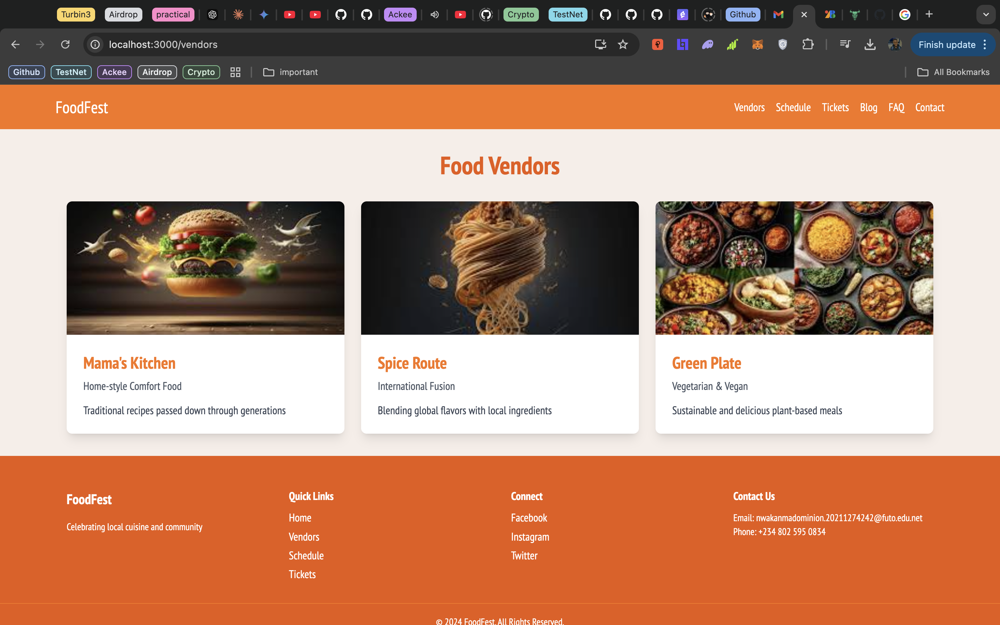

# FoodFest - Event Management Website

**FoodFest** is an event management website designed to celebrate and showcase local cuisine. This annual food festival website is built with React, TypeScript, and Tailwind CSS, featuring a DevFest-inspired design and optimized for an intuitive user experience. This website was built for the CIT 306 assignment under supervision of Engr. Doctor Amadi

## Table of Contents

- [Demo](#demo)
- [Features](#features)
- [Technologies Used](#technologies-used)
- [Project Structure](#project-structure)
- [Getting Started](#getting-started)
- [Running the Project](#running-the-project)
- [Screenshots](#screenshots)
- [Folder Structure](#folder-structure)
- [Contributing](#contributing)
- [License](#license)

---

## Demo

**[Live Demo](URL_TO_LIVE_WEBSITE)** _(Add a link to your deployed site if available)_

## Features

- **Event Listing**: Display upcoming food events with details and schedules.
- **Vendor Directory**: Showcase participating vendors and their offerings.
- **Interactive Map**: A festival map with highlighted zones and vendor locations.
- **Tickets**: Ticket sales and registration forms.
- **Blog Section**: Updates and articles about the food festival.
- **FAQ & Contact**: Common questions and a contact form for inquiries.

## Technologies Used

- **Frontend**: React, TypeScript
- **Styling**: Tailwind CSS
- **Routing**: React Router
- **Icons**: Heroicons (via `@heroicons/react`)
- **Fonts**: Inter, PT Sans Narrow, and Poppins from Google Fonts

---

## Project Structure

Below is a high-level view of the directory structure of the FoodFest project:

```
/foodfest
├── public/
├── src/
│   ├── assets/
│   ├── components/
│   ├── pages/
│   ├── types/
│   ├── utils/
│   ├── styles/
│   ├── App.tsx
│   └── index.tsx
├── package.json
└── tsconfig.json
```

See the [Folder Structure](#folder-structure) section for a detailed breakdown.

---

## Getting Started

To set up and run this project locally, follow these steps:

### Prerequisites

- **Node.js** (>= 14.x)
- **npm** or **yarn**

### Installation

1. **Clone the Repository**:

   ```bash
   git clone https://github.com/immadominion/foodfest.git
   cd foodfest
   ```

2. **Install Dependencies**:

   If you’re using **npm**:

   ```bash
   npm install
   ```

   Or if you’re using **yarn**:

   ```bash
   yarn install
   ```

3. **Configure Environment Variables**:

   Create a `.env` file if you need environment variables. This might include configurations for API endpoints or other sensitive data.

---

## Running the Project

1. **Start the Development Server**:

   ```bash
   npm start
   ```

   Or with **yarn**:

   ```bash
   yarn start
   ```

2. **Open the Website**:

   After the server starts, open your browser and go to:

   ```
   http://localhost:3000
   ```

3. **Building for Production**:

   To build the app for production:

   ```bash
   npm run build
   ```

   Or with **yarn**:

   ```bash
   yarn build
   ```

This creates an optimized production build in the `build` directory.

---

## Screenshots

### Homepage


### Event Highlights


### Vendor Directory



---

## Folder Structure

```plaintext
/foodfest
├── public/
│   ├── index.html               # Root HTML file
├── src/
│   |── assets/                  # Images, icons, and other static assets
│   ├── components/              # Reusable components
│   │   ├── Layout/              # Header, Footer, Navigation components
│   │   ├── Vendors/             # Vendor components
│   │   ├── Schedule/            # Event schedule components
│   │   ├── Tickets/             # Ticket and registration forms
│   │   ├── Map/                 # Festival map component
│   │   ├── Blog/                # Blog listing and detail components
│   │   ├── FAQ/                 # FAQ section component
│   │   └── Contact/             # Contact form component
│   ├── pages/                   # Main page components
│   ├── types/                   # TypeScript types
│   ├── utils/                   # Utility functions
│   ├── styles/                  # Global CSS and styling
│   ├── App.tsx                  # Main app component
│   └── index.tsx                # Application entry point
├── package.json                 # Project manifest
└── tsconfig.json                # TypeScript configuration
```

---

## Contributing

If you'd like to contribute to FoodFest:

1. Fork the repository.
2. Create a new branch (`git checkout -b feature/YourFeature`).
3. Commit your changes (`git commit -m 'talk about your new feature'`).
4. Push to the branch (`git push origin feature/YourFeature`).
5. Open a pull request.

## License

This project is licensed under the MIT License - see the [LICENSE](LICENSE) file for details.

---

## Contact

For inquiries or support, please contact **[nwakanmadominion.20211274242](mailto:your-email@example.com)**.
